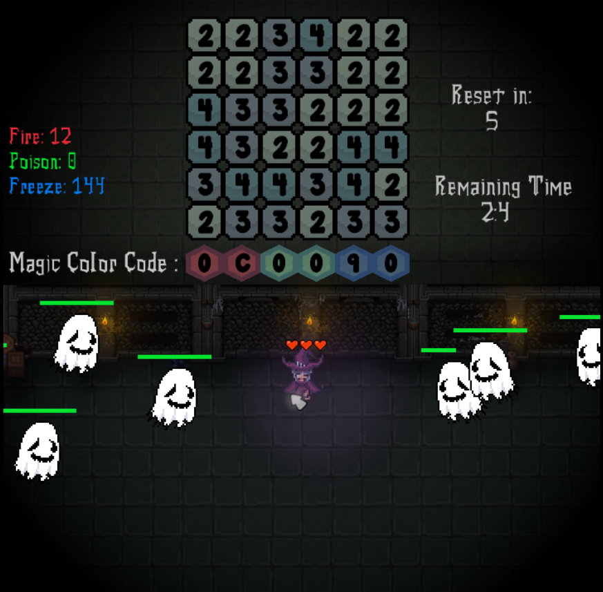

## Merge The Hexes

### Description

Merge The Hexes is a 2D "Survival Roguelite" game i developed for "raylab 6.x 2026 GameJam".

### Features

 - Initializing powers from a hexadecimal color code
 - Tile match style gameplay
 - Challenging survival gameplay

### Controls

Mouse Left & Right Clicks!

### Screenshots

### Developers

 - Sobhan Azari Asl

### Links

 - itch.io Release: https://sobhan-azri.itch.io/mergethehexes

### License

This project sources are licensed under an unmodified zlib/libpng license, which is an OSI-certified, BSD-like license that allows static linking with closed source software. Check [LICENSE](LICENSE) for further details.

*Copyright (c) 2026 Sobhan Azari Asl (SobhanAzri)*
